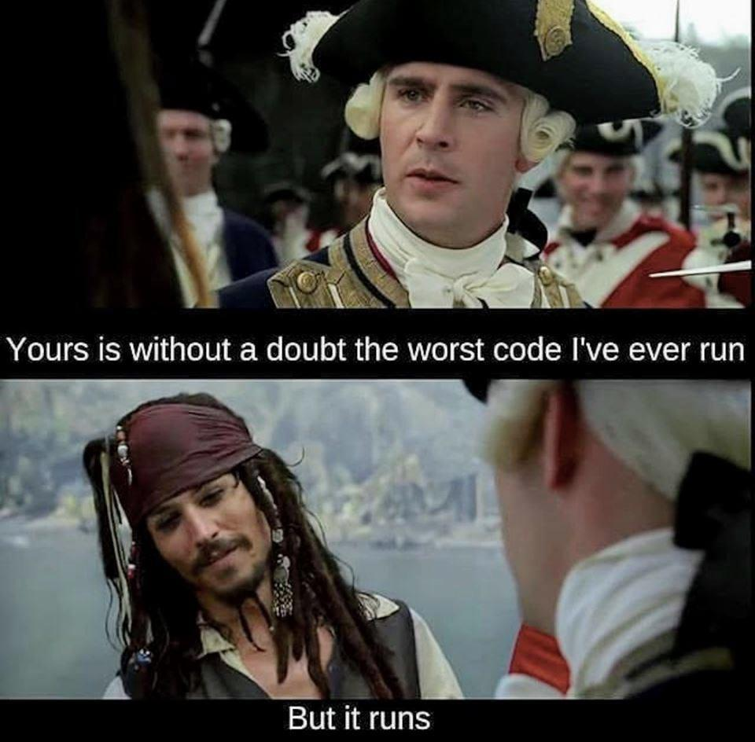

# Advent of Code 2022

So this year, I came across [Advent of Code](https://adventofcode.com/2022) (again), and decided to give it a go. Solutions in the repo, random notes below. I'll note that I didn't look up any solutions or hints anywhere else (especially including ChatGPT or CoPilot), this is 100% my own mess. (With the obvious exception that I have to google super-primitive Python idioms all the time. Did you know that `swap(a,b)` in Python is canonically `b,a = a,b`? Neat, isn't it?) 

*Warning ⚠️ spoilers below*

### Day 1-6

All pretty straightforward, not much to screw up 😉

### Day 7 (File System)

Recursion FTW!

### Day 8 (Treehouse View)

First one that requires a bit of thinking so you don't end up with quadratic runtime:
for each tree, check only the row/column it is actually standing in, not all other trees.
(may seem obvious in hindsight, but hey 😉)

### Day 9 (Rope Bridge)

Not very computationally intensive, but pretty tricky to get all the special cases correct about how the knot(s) can move, esp. for part 2.

### Day 10 (CRT Simulation)

Surprisingly simple, and if you think that CRT controller is unrealistic, wait until you've worked with a couple of real-world embedded devices, this doesn't even count as weird. Pay attention to off-by-one errors.

### Day 11 (Monkeys)

First real challenge: in part 1, to parse all the various bits and pieces and simulate them for 20 rounds without missing something, and then in part 2, to make it run while the numbers you're working with
suddenly blow up to ridiculous sizes. If you just let Python use its internal bignum implementation, it grinds to a halt somewhere around round 110, you'd get old and grey waiting for round 10000.
But since all the tests the monkeys use are based on looking at the remainder of a prime number division, you can just take the product of all these primes and then always calculate the remainder 
relative to that product for each worry level.

### Day 12 (Hill Climbing)

Now we're definitely in Algorithms 101 territory. You can treat the heightmap as a graph, and if it is possible to take a step from one location to another, then that corresponds to an edge in the graph.
And for shortest path in a graph, we have good ol' Dijkstra's algorithm. Unfortunately, Python doesn't have a priority queue implementation built in where you can modifiy the elements while they are 
in the queue, so I hacked a naive list-based implementation together, but it worked quickly enough. 

For part 2, I first tried the "all-pairs shortest-path" algorithm by Floyd and Warshall, but that has O(n³) runtime complexity and I made a mistake somewhere, so I had it run for over an hour before it 
spit out a wrong solution. 😑 Since Dijkstra is efficient enough, I ended up just running that again for each potential starting point, which was way faster than the matrix algorithm (just pay attention 
to disconnected subgraphs 😉).

### Day 13 (Distress Signal)

This one just screams for a recursive approach for the comparator. And I wasn't going to pass on using `eval()` for parsing that stuff directly into a Python list.
Part 2 is really straightforward, just wrap the comparision function into a class with a comparison operator (`__lt__`) and throw all the classes into a list, then call `.sort()`. Done.

### Day 14 (Sandfall Simulation)

Can be simulated in a large array. Just look for the minimum and maximum x/y values while parsing, and use that to size your array, then just run it step-by-step exactly as described in the example.

### Day 15 (Beacons and Sensors)

The first part is again relatively straightforward: for any given location, check if it is farther away (by Manhattan distance) from each sensor than that sensor's closest beacon. Conversely, if a location is closer to any one sensor than its closest beacon, then it cannot contain a beacon, because that would otherwise be that sensor's closest one. I picture it as an "exclusion zone" around each sensor. In any case, for part 1, I picked the midpoint between the sensors (average of all sensor x coords) and then scanned outwards on the given y coordinate, both left and right, until I found the first location that _could_ contain a beacon. Sum together, done.

And then part 2. I admit that had me pretty stumped at first; I did try the naive 4M x 4M loop, but that would need somewhere around 16 * 10^12 location checks, each with an iteration through the sensor array, and a rough estimate put the runtime on my laptop somewhere around 47 days. Probably not the way to do it, then. 

I did turn this over in the back of my head for nearly the whole day, and finally had the realization that if there is only a single location that fits, then it must be exactly outside the border of an exclusion zone. And thanks to Manhattan distance, the exclusion zones all have a very symmetric diamond shape, so it's not too difficult to just scan around the outside of the exclusion zone of each sensor and check whether any other sensor can see that location. Bam, also solved. 😁

### Day 16 (Volcano Valves)

So... not solved yet. Hamilton cycles? Maybe not, perhaps rather test all permutations of the valves with shortest paths in between? Implemented the second idea, but again with a crazy runtime of something * 10^12 seconds, 700 days or so. This needs more work. Probably possible to represent only the valves and paths as a smaller graph and then run Floyd-Warshall again?

### Day 17 (Rock Tetris)

Part 1: not so super-hard, a bit tedious to handle the various rock shapes, but a relatively straightforward step-by-step simulation. The second part gets more interesting, because my approach would take about 277 days again, this needs a _bit_ more optimization (the memory requirements aren't a problem, because you can just pop a couple 1000 lines off the bottom of the array periodically and add empty ones on top again).

Part 2: I soon had the idea that there might be some repetition in the rock pattern that you can use to shortcut the simulation, but it took me forever to make it work. The insight I had missed until today (Dec. 27th!) was that the repetition doesn't necessarily have to start at position 0 again. But this is now solved at last.

### Day 18 (Lava Droplets)

Part 1 is again really not that hard, fill a 3D array with the cubes but keep a list of their coordinates, and then walk through them again and check how many 6-neighbors each one has.

Part 2 is a bit trickier, but I found an (IMHO 😉) pretty elegant solution: first count all outside faces as above, then do a 3D flood fill of the "outside" of the lava droplet, starting at `[0,0,0]`, then count all outside faces _again_ (this time, only the "air pockets" inside will be left) and subtract that from the first number. Done.

### Day 19 (Resource Robots)

Very similar to day 16, and I'm having the same problems 😑 Will have to get back to this one later.

### Day 20 (Un-mixing Encryption)

Part 1 looked relatively straightforward, though I apparently had overlooked some ugly edge cases that were not handled properly, that took some time. The knack is that the regular array has two ends, but as the result should be considered circular, it only has one potential insertion slot "between" the ends.

Part 2 took waaaay longer again (until the 27th!), until I realized that I can just calculate everything modulo `size - 1` instead of `size`, then it was solved in five minutes.

### Day 21 (Monkey Math)

Part 1 finally solved again at the first try 😅 Have a dict from name to class `Monkey`, which lists dependent monkeys on left and right side. Then repeatedly fill in the data from those monkeys that already have an answer, until you reach the "root" monkey.

Part 2: a bit more involved, but instead of propagating data upwards to the root monkey, now propagate results downwards and invert the operators every time.

### Day 22 (Maze)

Part 1 took forever - I had overlooked that the last movement instruction does not end with a letter and had therefore skipped on parsing the final step count. Meh.

Part 2 was surprisingly tedious, I did not find a clever way to implement the "cubemap" wrapping other than handling each one of 14 separate cases (transitions from one cubeface to another) individually... 

### Day 23 (Diffusion)

...

### Day 24 (Blizzards)

Another one that follows the same pattern where my brain somehow doesn't click (just like 16 and 19). Revisit next year.

### Day 25 (SNAFU Numbers)

That one was easy - do a plain old modulo division for each position, but add two on each iteration before dividing. But I'm still missing a bunch of stars from the previous days, let's see if I can still manage to collect them sometime 😉

